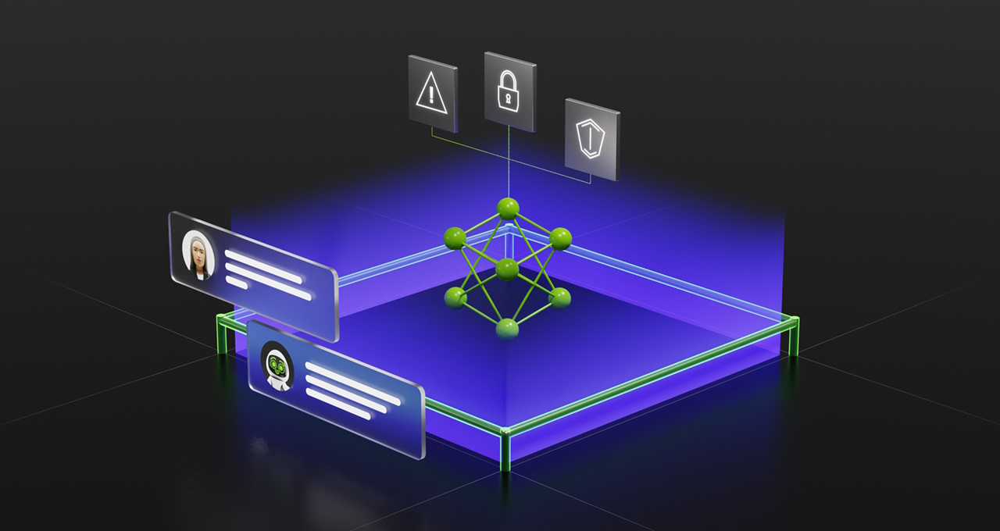

# Enhancing Llama2 Conversations with NeMo Guardrails
This repository showcases the integration of [NVIDIA NeMo Guardrails](https://github.com/NVIDIA/NeMo-Guardrails) with the [Llama2](https://ai.meta.com/llama/) model.  

# Features
- **Programmable Guardrails:** Define the behavior of your LLM, guiding conversation and preventing discussions on unwanted topics
- **Seamless Integration:** Easily connect your LLM to other services and tools (e.g., [LangChain](https://python.langchain.com/docs/get_started/introduction)), enhancing its capabilities
- **Customization:** A specialized modeling language, [Colang](https://github.com/NVIDIA/NeMo-Guardrails/blob/main/docs/user_guide/colang-language-syntax-guide.md), that allows you to define and control the behavior of your LLM-based conversational system.

# Examples
We focus on three common use cases:

- [Topic Guidance and Safety Measures](./Topic_RAIL.ipynb)
  Guide the model to stick to certain topics and avoid specific questions. Essentially, the Guardrail layer examines every user input and filters them based on set rules.

- [Fact-Checking Guardrails](./Fact_Check_RAIL.ipynb)
   Ask the LLM to check its answers for accuracy with the given context. Basically, the LLM verifies its response using the information pulled from a knowledge base.

- [Guardrails Against Hallucinations](./Hallucination_RAIL.ipynb)
  Designed for situations where there is no knowledge base. 

# Documentation
- Enhancing Llama2 Conversations with NeMo Guardrails: A Practical Guide [blog post](https://blog.marvik.ai/2023/10/09/enhancing-llama2-conversations-with-nemo-guardrails-a-practical-guide/).
- NVIDIA Nemo Guardrails [documentation](https://github.com/NVIDIA/NeMo-Guardrails/tree/main/docs).
- NVIDIA Nemo Guardrails official [repo](https://github.com/NVIDIA/NeMo-Guardrails).
